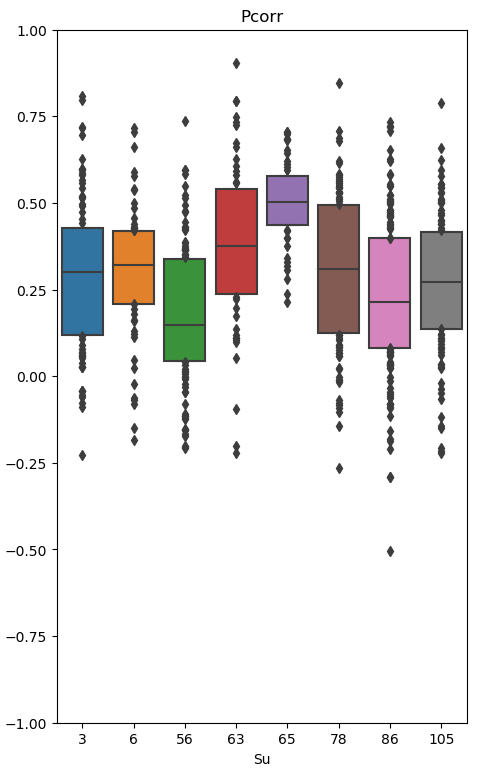

***Work in progress. Not for distribution.***

# RNN models of the rs-fMRI signal
AUTHORS: H.Mandelkow <Mandelkow[at]icloud.com>

<!-- ## Synopsis -->
#### _Can DNNs be used to model the fMRI signal as a function of external stimuli and internal covariates like the heart beat and respiration?_
fMRI data analysis is traditionally treated as a regression problem and solved by fitting a *general linear model* (GLM) to individual voxel time series. A major disadvantage of the GLM approach lies in the fact that it depends on regressors with high explanatory power, which are hard to come by experimentally or based on intuition. DNNs might offer a systematic, data-driven solution to this problem. One straight-forward approach would be to replace the GLM with a nonlinear RNN model. RNNs are famous for modeling time series. Of course, the ideosyncrasies of neuroimaging data pose specific challenges including:

1. a limited amount of training data
2. data sampled on vastly different time scales
3. systematic heterogeneity that requires an adaptive ARX-type model to generalize across experiments, subjects and brain regions

Here we use Python3 + Keras/TF to develop RNN models that can be trained on undersampled (missing) data and learn to adapt (generalize) to variable input/output statistics.

## agenda:
- [x] simplified RNN model maker + custom loss
- [x] custom loss (masked MSE) to ignore missing data
- [x] custom batch generator for parallel GPU training of voxels and temporal sections
    - [x] generate missing data mask
    - [x] dropout random / systematic
    - [x] methods for validation: .predict .evaluate .getY .reshapeModel etc.

## Preliminary results
<figure style="float:right;width:200px;">
<figcaption>Figure 1 Pearson corr. of data sections by subjects</figcaption>

</figure> 

The RNN clearly predicts a substantial amount of the global fMRI signal variance. But there is a lot of variability in the estimates. Pearson correlation coefficients are above 25% on average and up to 90% in the extreme (Fig.1).

This RNN can be trained better to generalize across experiments and subjects. However, looking at some of the most predictive wave forms in Fig.2 it seems likely that different physiological regimes exert an unequal amount of influence on the global fMRI signal. In other words, prediction errors also reflect those parts of the fMRI signal, which are independent of the physiological predictor variables. In such a regime the RNN could serve as a physiological noise filter.

Most interesting is the observation that the RNN apparently identifies fluctuations in the pulse-ox. *amplitude* (Fig.1, blue) as features often predictive of dips in the fMRI signal. This effect of sympathetic tone on the global fMRI signal is associated with arousal and has only recently been described in a paper by Ozbay and colleagues (Ozbay et al. 2019). In other experiments the global fMRI signal (and the pulse-ox. amplitude) are highly correlated with the respiratory cycle (Fig.2D).

 
<!-- "style" does not work on Github!? -->

**Figure 2A-D** 3 different samples (columns) from 4 different subjects (rows) illustrating a variety of physiological regimes with strong coupling between RNN predictions (red) and the global fMRI signal (red dots). Input predictors are cardiac and respiratory signals (blue+orange).

